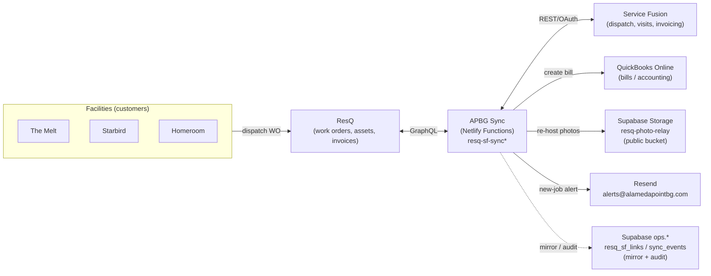
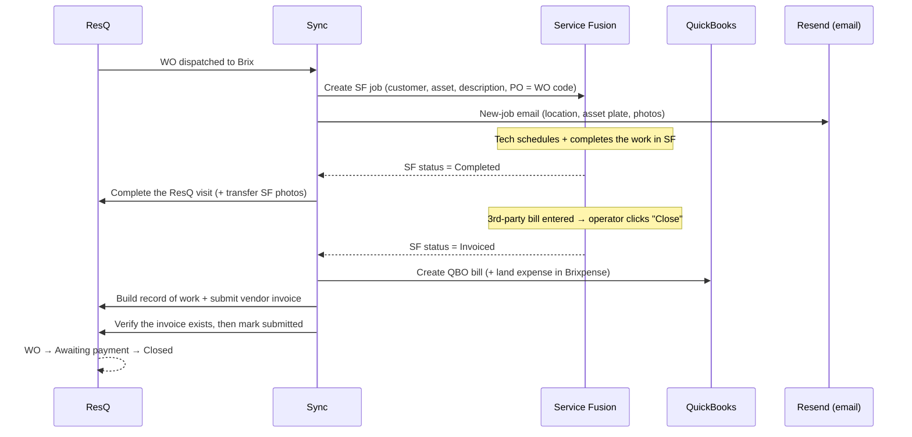

# ResQ ↔ Service Fusion ↔ QuickBooks Integration

**Owner:** Brix Beverage (PACER Group) · **Repo:** `skypace/apbg-billing` · **Runtime:** Netlify Functions (Node ESM)
**Last updated:** 2026-06-10

This document describes the live integration that keeps **ResQ** work orders in sync
with **Service Fusion** (Brix's field-service system) and **QuickBooks Online** (accounting),
plus the **new-job notification email**. It's meant as a single, exportable reference —
for the team and for ResQ when discussing official API access.

---

## 1. System overview

- **ResQ** is where facility customers raise work orders and dispatch them to Brix as the vendor.
- **The Sync** is a set of serverless functions that run on a schedule (every few minutes) and on demand.
- **Service Fusion** is Brix's own dispatch/visit/invoicing system.
- **QuickBooks** receives the 3rd-party bill.
- The **state of record** is a Netlify Blob (`wo-mapping`); `ops.resq_sf_links` + `ops.sync_events` are a read/audit mirror.

---

## 2. Work-order lifecycle

**Key guarantees**

- **One SF job per WO** — deduped by `po_number` (the ResQ WO code); cancelled SF jobs are auto-healed (re-link or recreate, capped).
- **Invoice on close is verified** — the sync only marks an invoice "submitted" after re-querying ResQ and confirming a `vendorInvoice` actually exists (no false successes).
- **Idempotent** — per-WO flags (`invoiceSubmitted`, `visitCompleted`, `notified`) prevent duplicate actions/emails.
- **Done WOs are left alone** — once a WO is `AWAITING_PAYMENT` / `CLOSED` / `CANCELLED`, the sync stops touching it.

---

## 3. Data read from ResQ (GraphQL)

ResQ has GraphQL **introspection disabled**, so the field set below was confirmed by direct probing.

| Object | Fields used |
|---|---|
| `workOrder` | `code`, `title`, `description`, `status`, `isUrgent`, `serviceCategory`, `raisedOn`, `vendor`, `executingVendor`, `images { url }`, `appointment`, `latestVisit`, `inProgressVisit`, `invoiceSets { vendorInvoices, recordOfWorks }` |
| `equipment` (asset) | `name`, `manufacturer` (make), `modelNo` (model), `serialNo`, `code` (asset #), `warrantyNotes`, `description`, `image`, `photos { url }` |
| `facility` | `name`, `address`, `addressLine2`, `zipCode` |

> ResQ's `workOrders(code:)` filter is unreliable (returns empty even for visible WOs), so reads **scan** the recent WO list (`workOrders(first: 500, orderBy: "-raised_on")`) and match by code.

---

## 4. Data written to ResQ (GraphQL mutations)

| Mutation | When |
|---|---|
| `vendorChangeWorkOrderState` | Advance the WO out of `NOT_YET_SCHEDULED` when SF is scheduled |
| `startVisit` / `endVisit` | Complete the ResQ visit when SF marks the job completed |
| `addAfterImagesToVisit` | Push SF job photos onto the WO visit |
| `createRecordOfWork` → `saveRecordOfWork` → `submitRecordOfWork` | Build the record of work from SF line items |
| `createOriginalVendorInvoice` | Submit the vendor invoice (then verified) |
| `createUpdatePayoutOffer` | Set the payout offer |

---

## 5. New-job notification email

When a WO is first picked up, an email is sent (via **Resend**, from `alerts@alamedapointbg.com`) to the ops owners.

**Contents:** WO code · location (facility + street address) · **asset data plate** (Make / Model / Serial / Asset # / Warranty) · what's wrong (title + description) · **photos inline**.

**Photo handling:** ResQ serves photos as short-lived **signed S3 URLs**. To render them inline (signed URLs expire and break in mail clients), each photo's bytes are fetched at send time and **re-hosted in a public Supabase Storage bucket** (`resq-photo-relay`); the stable public URL is embedded inline, with a click-through link beneath each.

- Recipients: `RESQ_JOB_NOTIFY_TO` (default `skypace@brixbev.com,whitney@alamedasoda.com`).
- Fires once per WO (idempotent); WOs that link to a pre-existing SF job don't email.

---

## 6. Credentials / configuration

| Env var | Purpose |
|---|---|
| `RESQ_EMAIL` / `RESQ_PASSWORD` | ResQ **vendor** login (session/CSRF auth — there is no official API key) |
| `RESQ_FACILITY_EMAIL` / `RESQ_FACILITY_PASSWORD` | ResQ **facility** login (fallback for assets/photos the vendor can't see) |
| Service Fusion OAuth (consumer creds) | SF REST API |
| `CRON_SECRET` | Lets Supabase pg_cron POST the sync |
| `RESEND_API_KEY` | Notification email |
| `SUPABASE_SERVICE_ROLE_KEY` | Photo relay bucket + `ops.*` mirror writes |
| `RESQ_JOB_NOTIFY_TO` | New-job email recipients |

---

## 7. The one limitation — and the ask

Everything above works, but the ResQ side is built on **mimicking the web app** (username/password session + GraphQL), not a documented API. Consequences:

- **Introspection is off** → field names are discovered by trial.
- **Photo URLs are short-lived signed S3 links** → require the re-host workaround in both directions; ResQ also stores image refs in a `varchar(100)`, which overflows on long URLs.
- **Authorization gaps** → e.g. the vendor account isn't allowed to add after-images (we fall back to the facility login).
- **No rate-limit/SLA contract** → the `code` filter is unreliable; we scan instead.

**Request to ResQ:** a documented API integration (API key / OAuth client), scoped to Brix as the vendor, with **read** access to dispatched work orders + assets and **write** access to visits, records of work, vendor invoices, and attachments. That makes this integration reliable, secure, and supported — and removes the fragile parts (signed-URL games, blind field probing, the varchar overflow, the authorization fallbacks).

---

## 8. Source map

| Concern | File |
|---|---|
| Dispatcher / on-demand actions | `netlify/functions/resq-sf-sync.mjs` |
| Sync worker (lifecycle, invoice, dedup, auto-heal) | `netlify/functions/resq-sf-sync-background.mjs` |
| ResQ login + GraphQL | `netlify/functions/resq-helpers.mjs` |
| Service Fusion client | `netlify/functions/sf-helpers.mjs` |
| New-job email + asset enrichment | `netlify/functions/lib/resq-job-notify.mjs` |
| Photo relay + SF asset fetch | `netlify/functions/lib/sf-assets.mjs` |
| Email transport (Resend) | `netlify/functions/email-helpers.mjs` |
| `ops.*` mirror + audit | `netlify/functions/lib/resq-sf-links.mjs` |
| Dashboard | `public/sync.html` |
