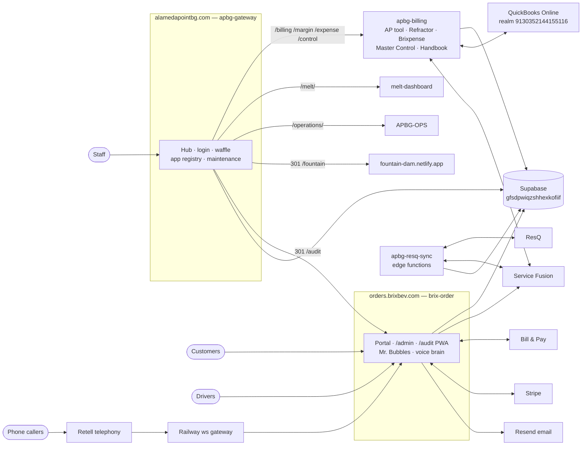
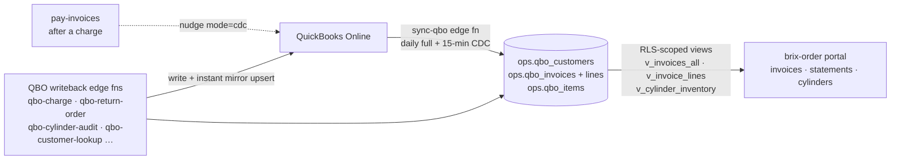
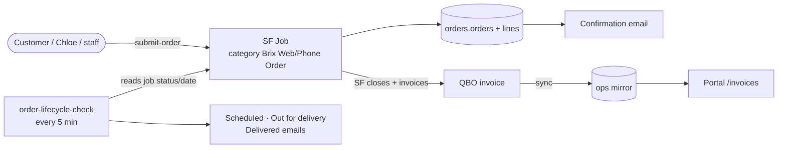
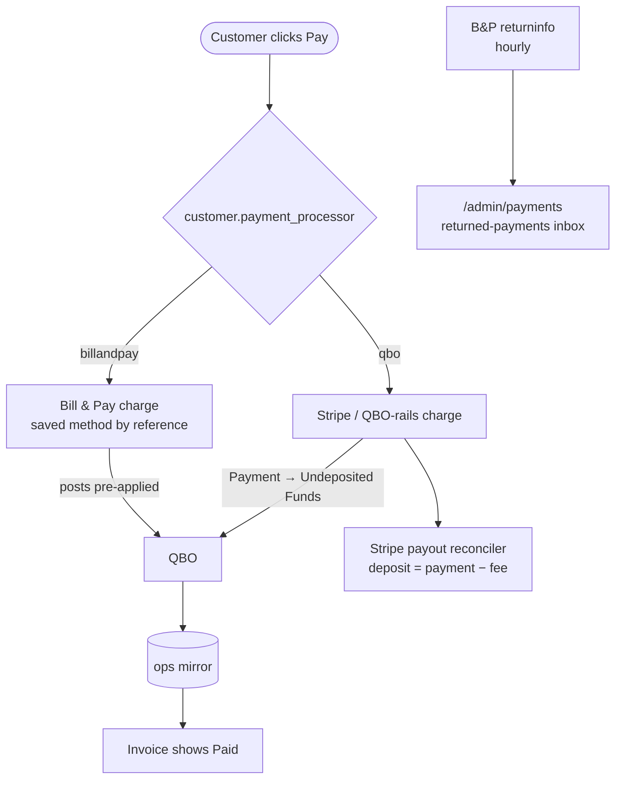
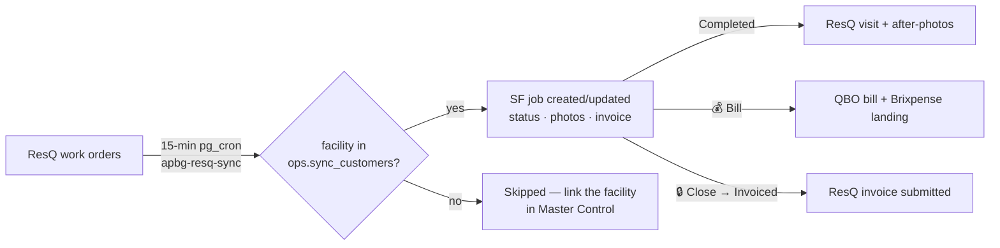

# Architecture & Data — How the Programs and Data Work

> Architecture & Data · Owner: Sky Pace · Last reviewed: 2026-07-22

This chapter is the visual map of how APBG's systems fit together — the apps, where the data lives, and the pipelines that move it. It summarizes and diagrams the [master architecture handbook](https://github.com/activespacescience/Skilliosis_Mytosis_Architecture/blob/main/ARCHITECTURE.md); the always-current original renders in the [Live Architecture Mirror](#/13-architecture-live) chapter. Diagrams here are Mermaid — they render inline in this viewer.

## System map

Everything public flows through the gateway at `alamedapointbg.com`; the order portal has its own front door at `orders.brixbev.com`.

## Where the data lives

One shared Supabase project (`gfsdpwiqzshhexkofiif`) holds several schemas with strict ownership:

| Schema | Owner | What's in it |
|---|---|---|
| `ops.*` | apbg-billing sync stack | QBO mirror (customers, invoices, items, invoice lines), SF/QBO token caches, Brixpense tables, production (formulas/BOMs/WOs/POs), `sync_customers` (ResQ↔SF map). **Read-only to brix-order.** New writers must register in `architecture/sync-manifest.json` — the build lint enforces it. |
| `orders.*` | brix-order | Customers/locations/memberships, orders + lines, payments + returns, cylinder audits, onboarding, service requests, KB documents + chunks (the bots' RAG), voice call sessions. |
| `public.*` | apbg-gateway | `gateway_apps` registry, `app_maintenance` banners/lockouts, auth users (shared). |
| `dam.*` | DAM-Fountain | Brand asset library metadata (assets in the `brand-assets` bucket). |

External systems of record: **QuickBooks Online** (money — one realm, multiple Intuit apps), **Service Fusion** (jobs/dispatch; pricing lives here and pushes to QBO), **ResQ** (Melt work orders), **Bill & Pay / Stripe** (payment rails), **Resend** (email), **DocuPost** (paper mail).

## The QBO mirror — how portal data stays current

The portal never calls QuickBooks directly. Everything financial flows through the `ops.*` mirror:

Consequences worth knowing: a just-paid invoice flips to **Paid** when the mirror refreshes (seconds via the post-payment nudge, ≤15 min via the CDC cron); writeback edge functions upsert the mirror immediately so counts don't lag a day.

## Order & fulfillment flow

The SF job is created **before** any local rows (no orphan orders); SF's own fee engine bills fuel/hazmat — our fee lines are display-only estimates.

## Payments — dual rail

Instrument entry (raw card/bank) happens **only** in Bill & Pay's hosted window or Intuit tokenized fields — never in our code (see [SOP-1](#/21-sop-security-access)).

## ResQ ↔ Service Fusion sync

## Scheduled jobs inventory

| Job | Cadence | Lives in | What it does |
|---|---|---|---|
| `sync-qbo` full | daily ~09:35 UTC | Supabase edge fn | Full QBO → `ops.*` mirror refresh |
| `qbo-cdc-sync` | every 15 min | pg_cron → sync-qbo `mode=cdc` | Changed-invoice mirror refresh (paid toggles) |
| ResQ↔SF sync | every 15 min | pg_cron (apbg-resq-sync) | Work-order → SF job state machine |
| `order-lifecycle-check` | every 5 min | brix-order Netlify cron | SF job status → order status + lifecycle emails |
| `billandpay-returns-check` | hourly | brix-order Netlify cron | Pull B&P returns → inbox + alert email |
| `invoice-notify` | hourly | brix-order Netlify cron | Post-delivery invoice emails (PDF attached) |
| Stripe payout sweep | daily 15:47 UTC | brix-order | Retry payout → QBO deposit posting |
| Token keep-alives | continuous | apbg-billing | QBO/SF OAuth freshness (Master Control tiles) |

## Keeping this chapter honest

This overview is registered in the sweep against the master `ARCHITECTURE.md` — when the architecture handbook changes, this chapter flags stale in [Master Control](#/09-master-control). The [Live Architecture Mirror](#/13-architecture-live) never drifts: it renders the current file straight from GitHub. The [Change Log](#/90-change-log) tab shows what actually shipped across every repo.

## Related

- [Live Architecture Mirror](#/13-architecture-live) — the full master handbook, rendered live
- [Change Log](#/90-change-log) — automatic feed of commits across all APBG repos
- [SOP-9 · Data & Engineering](#/29-sop-data-engineering) — schema ownership, migration and secrets policy
- [Master Control](#/09-master-control) — health, sync controls, the handbook sweep
